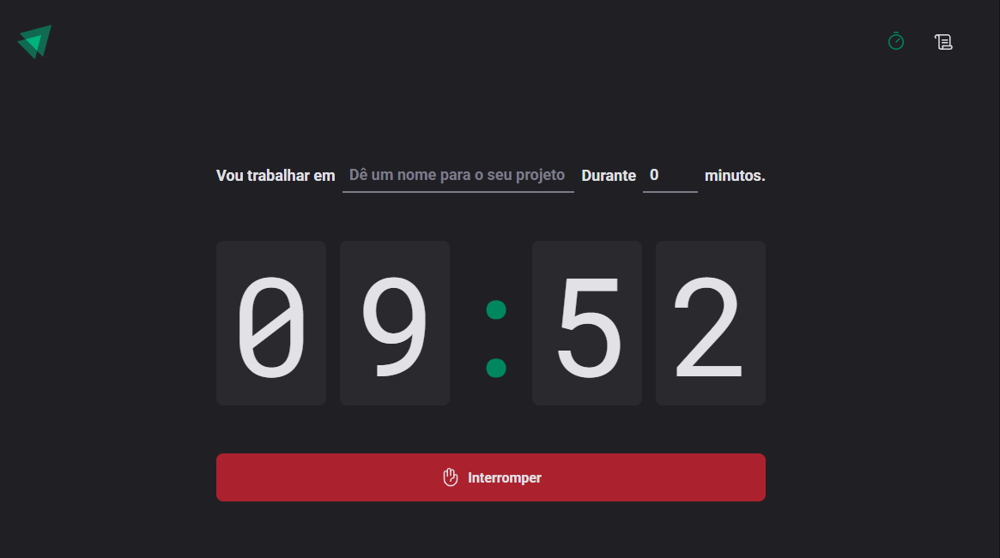

# Pomodoro App - React + TypeScript + Vite

Este é um app feito em React para gerenciar ciclos Pomodoro.



## Funcionalidades

- **Criarciclos**: Crie ciclos de até 60 minutos.
- **Histórico de ciclos**: Visualize seus ciclos criados e seus status.
- **Persistência no Local Storage**: Todos os ciclos são salvos no local storage, garantindo que as informações sejam mantidas mesmo após a atualização da página.

## Como Executar

Se quiser rodar o projeto localmente:

Clone este repositório:
   ```bash
   git clone https://github.com/salesmiguelz/pomodoro-react
  ```
Instale as dependências:
  ```bash
  npm install
  ```
Execute o projeto:
```bash
npm run dev
```